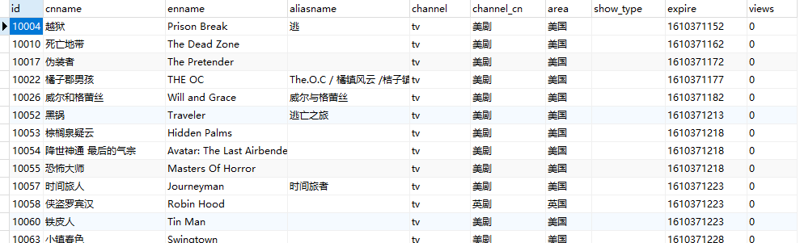

# YYeTs_db

Sqlite3 database of YYeTs.

`Across the Great Wall we can reach every corner in the world.`

[toc]

## About The Project

YYeTs has been shut down for some reason. So I parsed download links and saving to database from raw data. You can now search with SQL and download movies with the link you got. The links are still available **for now**. 

Why sqlite:

* Offline. You can search without network so that no one can "shut down" your "sql server".
* Easy. No need to install python package for sql driver. Python has built-in sqlite module since python 2.5.x.

The cost is that you should download the whole database first (30M+ zip, 220M+ disk space).

## Usage

1. download latest release
2. unzip
3. open with sqlite3
4. search url with SQL

## TBD

* [x] upload tool script.
* [x] update readme.md.
* [ ] upgrade searching strategy. For now the searching is using `Left-Prefix Index Rule` for efficiency.
* [ ] user interface with python CLI.

## Credits

Thanks for the data source.
[@BennyThink](https://github.com/BennyThink)
